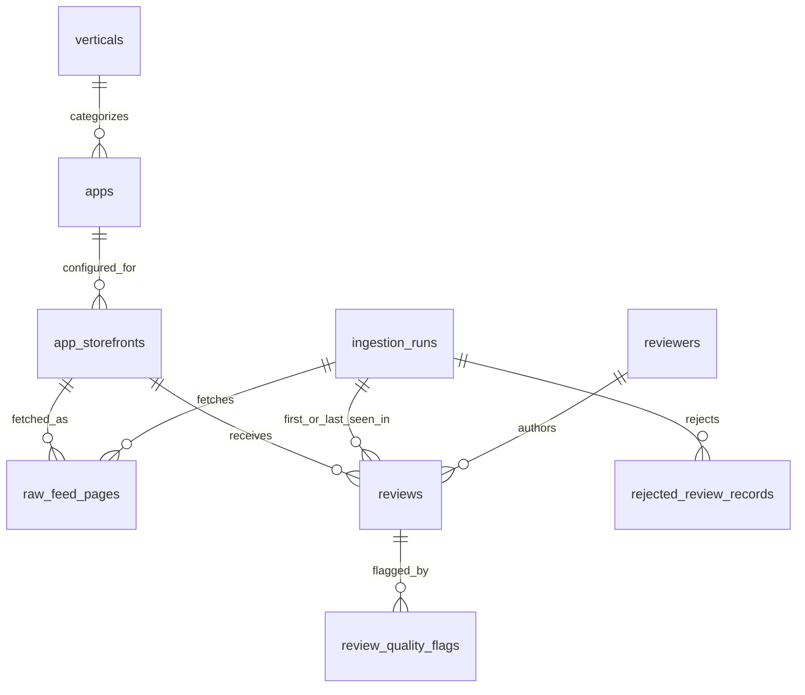

# Step 3: Designing and Implementing the Database Layer

## Objective

The database layer will persist Apple App Store review data in a relational structure that supports repeatable ingestion, SQL-based analysis, quality control, and downstream machine learning workflows.

The design needs to satisfy three Phase I goals:

- store raw source responses for auditability and future reparsing
- store normalized review records for querying and analytics
- expose clean, training-ready review data without losing the original source context

For the prototype, SQLite is sufficient because the first cohort is intentionally small: 30 to 50 apps, a single US storefront, and recent reviews from the public RSS feed. The schema should remain PostgreSQL-compatible so the same logical model can be promoted when ingestion becomes scheduled, collaborative, or multi-source.

## Technology Choice

### Prototype: SQLite

SQLite is recommended for Phase I because it is lightweight, easy to run locally, and requires no database server. It is appropriate for:

- local feasibility testing
- repeatable ingestion runs
- small app cohorts
- simple SQL analytics
- handoff files for labeling and modeling teams

### Deployment Path: PostgreSQL

PostgreSQL should be the deployment target once the pipeline expands to scheduled runs, multiple storefronts, multiple team members, or heavier analytics. The schema is designed so the migration path is straightforward:

- SQLite `TEXT` timestamps can become PostgreSQL `TIMESTAMPTZ`
- SQLite raw JSON strings can become PostgreSQL `JSONB`
- SQLite indexes can be recreated as PostgreSQL B-tree indexes
- analytical views can be kept with minimal SQL changes

## Relational Model

The schema separates stable source entities from operational ingestion records and analytical review records.

Core entities:

- `verticals`: controlled business categories, such as fintech, travel, retail, food delivery, education, health, productivity, and social
- `apps`: configured App Store apps selected for the cohort
- `app_storefronts`: per-app/per-country ingestion configuration
- `reviewers`: public author labels and author URIs from the feed
- `ingestion_runs`: one row per execution of the ingestion pipeline
- `raw_feed_pages`: raw RSS/JSON pages fetched during each run
- `reviews`: normalized deduplicated review records
- `rejected_review_records`: malformed or incomplete review objects that cannot be safely loaded
- `review_quality_flags`: validation and data quality annotations attached to reviews

This structure keeps app metadata, author metadata, raw source pages, and normalized review content separate while preserving the joins needed for analytics.

## Entity Relationship Overview



For this source, `apps` function as the product entities and `reviewers` function as the public user-like entities. The design avoids calling them private users because the RSS feed only provides public author labels and author URIs.

## Logical Schema

### `verticals`

Stores the controlled vertical taxonomy used for cohort balancing and analysis.

Key fields:

- `vertical_id`: primary key
- `vertical_name`: unique business category name
- `description`: optional explanation of the category
- `created_at`: record creation timestamp

### `apps`

Stores the manually selected app cohort.

Key fields:

- `app_id`: internal primary key
- `source_platform`: `apple_app_store` for Phase I
- `source_app_id`: Apple numeric app id as text
- `app_name`: display name used in analysis
- `vertical_id`: foreign key to `verticals`
- `developer_name`: optional app publisher name
- `app_store_url`: optional public App Store URL
- `is_active`: whether the app is included in ingestion
- `created_at` and `updated_at`

Unique key:

```text
(source_platform, source_app_id)
```

### `app_storefronts`

Stores country-specific ingestion settings for each app. This lets the same app later be collected from additional storefronts without changing the app table.

Key fields:

- `app_storefront_id`: primary key
- `app_id`: foreign key to `apps`
- `storefront`: country code, initially `us`
- `expected_language`: initially `en`
- `rss_url_template`: endpoint template used by the fetcher
- `max_pages_per_run`: default 10
- `is_active`: whether this app/storefront pair should be ingested
- `last_successful_ingestion_at`: operational checkpoint

Unique key:

```text
(app_id, storefront)
```

### `reviewers`

Stores public reviewer identifiers from the RSS feed. This is not a private user identity table. It only preserves public author labels and source URIs so reviews can be grouped when the feed provides stable author metadata.

Key fields:

- `reviewer_id`: primary key
- `source_platform`: `apple_app_store`
- `author_uri`: public author URI from the feed, nullable
- `author_label`: public author display label
- `author_fingerprint`: deterministic hash of source platform plus author URI or label
- `created_at` and `updated_at`

Unique key:

```text
(source_platform, author_fingerprint)
```

### `ingestion_runs`

Stores pipeline execution metadata.

Key fields:

- `ingestion_run_id`: primary key
- `source_platform`: `apple_app_store`
- `run_status`: `running`, `completed`, `completed_with_errors`, or `failed`
- `started_at` and `completed_at`
- `config_snapshot`: JSON/text copy of the app cohort and run settings
- `apps_requested`, `pages_fetched`, `reviews_parsed`, `reviews_inserted`, `reviews_updated`, `reviews_rejected`
- `error_summary`: JSON/text summary of failures

This table makes every dataset reproducible back to the ingestion run that created or updated it.

### `raw_feed_pages`

Stores raw responses from the Apple RSS/JSON endpoint.

Key fields:

- `raw_feed_page_id`: primary key
- `ingestion_run_id`: foreign key to `ingestion_runs`
- `app_storefront_id`: foreign key to `app_storefronts`
- `source_url`: full requested URL
- `page_number`
- `http_status`
- `fetched_at`
- `response_hash`
- `response_body`: raw JSON/XML as text
- `parse_status`: `pending`, `parsed`, `parse_error`, or `skipped`
- `parse_error`: nullable error message

Unique key:

```text
(ingestion_run_id, app_storefront_id, page_number)
```

### `reviews`

Stores deduplicated, normalized customer reviews.

Key fields:

- `review_id`: internal primary key
- `source_platform`: `apple_app_store`
- `source_review_id`: review id from the feed
- `app_id`: foreign key to `apps`
- `app_storefront_id`: foreign key to `app_storefronts`
- `reviewer_id`: foreign key to `reviewers`, nullable
- `rating`: integer 1 to 5
- `title`: review title
- `body`: review text
- `app_version`: app version reported by the review feed
- `review_url`: related source URL, nullable
- `published_at`: review timestamp normalized to UTC
- `detected_language`: language detected during normalization
- `body_char_count`: character count
- `body_token_estimate`: approximate token count
- `vote_count` and `vote_sum`: nullable public vote fields
- `raw_payload_hash`: hash of the source review object
- `first_seen_run_id` and `last_seen_run_id`
- `first_seen_at` and `last_seen_at`

Unique key:

```text
(source_platform, app_storefront_id, source_review_id)
```

This key makes ingestion idempotent. Repeated runs update mutable fields rather than creating duplicate rows.

### `rejected_review_records`

Stores source review objects that failed hard validation and therefore were not inserted into `reviews`.

Key fields:

- `rejected_review_record_id`: primary key
- `ingestion_run_id`: foreign key to `ingestion_runs`
- `raw_feed_page_id`: optional foreign key to the source page
- `app_storefront_id`: foreign key to `app_storefronts`
- `source_review_id`: source review id when present
- `rejection_reason`: controlled reason, such as `missing_review_id`, `missing_rating`, `invalid_rating`, `empty_body`, `invalid_timestamp`, or `malformed_payload`
- `rejection_details`: optional JSON/text detail
- `raw_payload_hash`: hash of the rejected review object
- `raw_payload`: rejected review object as JSON/text
- `created_at`

This table is intentionally separate from `review_quality_flags`: rejected records are not safe to use as canonical reviews, while quality flags describe records that were loaded but may need filtering or analyst attention.

### `review_quality_flags`

Stores validation flags without deleting potentially useful records.

Key fields:

- `review_quality_flag_id`: primary key
- `review_id`: foreign key to `reviews`
- `flag_type`: controlled flag, such as `non_english`, `empty_body`, `parse_warning`, `duplicate_text`, `rating_text_mismatch`, or `possible_spam`
- `flag_severity`: `info`, `warning`, or `error`
- `flag_details`: optional JSON/text detail
- `created_at`

This design lets the pipeline preserve raw data while allowing downstream consumers to filter to high-quality records.

## SQL Implementation

The Phase I schema implementation is provided in:

```text
outputs/phase_i_database_schema.sql
```

The implementation includes:

- table definitions
- primary keys
- foreign keys
- uniqueness constraints
- check constraints for ratings and run statuses
- indexes for common analytical queries
- rejected-record tracking for malformed review objects
- a `training_review_dataset` view for downstream labeling and model training

## Normalization and Performance Balance

The design uses moderate normalization:

- app metadata is stored once in `apps`
- country-specific collection settings are stored in `app_storefronts`
- public author metadata is stored once in `reviewers`
- raw source payloads are separated from normalized reviews
- hard validation failures are stored in `rejected_review_records`
- quality flags are separated from canonical review rows

This avoids heavy duplication while keeping review queries simple. Most downstream queries will join `reviews`, `apps`, `verticals`, and `app_storefronts`. Indexes on `published_at`, `rating`, `detected_language`, `app_id`, `app_storefront_id`, and source review uniqueness support common analytics without over-engineering the prototype.

## Common Query Patterns

### Recent Training Data

```sql
SELECT *
FROM training_review_dataset
WHERE detected_language = 'en'
  AND has_error_flag = 0
ORDER BY published_at DESC;
```

### Rating Distribution by Vertical

```sql
SELECT
  vertical_name,
  rating,
  COUNT(*) AS review_count
FROM training_review_dataset
WHERE detected_language = 'en'
GROUP BY vertical_name, rating
ORDER BY vertical_name, rating;
```

### Recent Negative Feedback by App

```sql
SELECT
  app_name,
  published_at,
  rating,
  title,
  body
FROM training_review_dataset
WHERE rating <= 2
  AND detected_language = 'en'
ORDER BY published_at DESC
LIMIT 100;
```

### Ingestion Health

```sql
SELECT
  ingestion_run_id,
  run_status,
  started_at,
  completed_at,
  apps_requested,
  pages_fetched,
  reviews_parsed,
  reviews_inserted,
  reviews_updated,
  reviews_rejected
FROM ingestion_runs
ORDER BY started_at DESC;
```

## Upsert Strategy

The ingestion process should insert reviews using the unique source key:

```text
(source_platform, app_storefront_id, source_review_id)
```

If a review already exists, the pipeline should update:

- `app_version`
- `vote_count`
- `vote_sum`
- `raw_payload_hash`
- `last_seen_run_id`
- `last_seen_at`
- `updated_at`

It should not overwrite:

- `first_seen_run_id`
- `first_seen_at`
- `source_review_id`
- `published_at`, unless a source correction is explicitly detected and logged

This preserves historical ingestion context while allowing source metadata to refresh.

## Data Quality Rules

The database layer should enforce hard constraints only for fields required for integrity:

- rating must be between 1 and 5
- review body must not be empty after trimming
- source review id must be present
- source platform must be present
- each review must belong to an app/storefront pair

Softer issues should be recorded as quality flags:

- non-English text
- suspiciously short body
- duplicate body across many reviews
- rating/text mismatch
- missing author metadata
- parse warnings
- possible spam or abuse content

This is important for sentiment work because unusual text can still be valuable training data if it is properly labeled or filtered.

Malformed records that fail hard constraints should be written to `rejected_review_records` instead of being silently discarded.

## Downstream Consumption

The database layer supports three downstream consumers:

- labeling teams, who need review text, rating, app, vertical, and quality flags
- analytics teams, who need SQL access to trends by app, vertical, rating, language, and time
- modeling teams, who need stable review ids, clean text fields, labels or weak labels, and reproducible dataset exports

The `training_review_dataset` view provides the default starting point for these consumers. It keeps the raw relational model intact while presenting a flatter table suitable for CSV export, notebooks, dashboards, or model training jobs.

## Privacy and Governance

The database should store only public reviewer metadata exposed by the RSS feed. It should not attempt to infer real identities, enrich author profiles, or combine reviewer records with external personal data.

Recommended governance practices:

- treat `author_label` and `author_uri` as public but still sensitive metadata
- avoid exporting reviewer identifiers unless needed for deduplication or abuse analysis
- keep raw source payloads access-controlled in shared environments
- document the source, storefront, and ingestion date for every exported dataset

## Implementation Verification

The SQLite implementation was validated by loading the schema into a temporary local database:

```text
sqlite3 /tmp/phase_i_schema_check.db ".read outputs/phase_i_database_schema.sql"
```

The schema loaded successfully and created:

- 9 tables: `verticals`, `apps`, `app_storefronts`, `reviewers`, `ingestion_runs`, `raw_feed_pages`, `reviews`, `rejected_review_records`, and `review_quality_flags`
- 1 analytical view: `training_review_dataset`

## Phase I Deliverable

The completed database layer should deliver:

- a relational schema for apps, storefronts, reviewers, ingestion runs, raw feed pages, reviews, rejected records, and quality flags
- a SQLite-compatible SQL implementation
- uniqueness constraints supporting idempotent ingestion
- indexes for rating, time, app, storefront, language, and vertical-based analysis
- raw response persistence for audit and reparsing
- a training-ready SQL view for downstream labeling and model workflows
- a clear migration path from local SQLite to PostgreSQL

This design gives Phase I a durable storage foundation without overbuilding the prototype. It is normalized enough to remain maintainable, but simple enough for fast iteration, inspection, and handoff.
